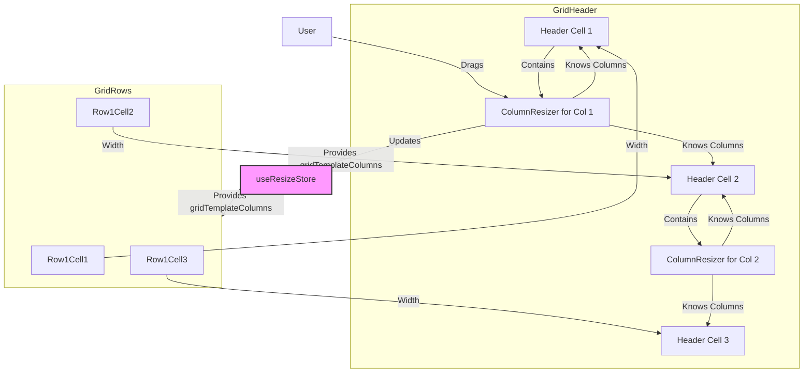

# Column Resizing Feature Plan

This document outlines the plan for implementing a column resizing feature for the React TypeScript grid library.

**Requirements:**

*   **Resizing Mode:** Adjust Adjacent Column (resizing one column affects the width of the adjacent column, keeping total grid width constant).
*   **Minimum Width:** 50px per column.
*   **Maximum Width:** None specified.
*   **Constraint Handling:** Stop resizing if either the resized column or the adjacent column hits the 50px minimum width.

## 1. Algorithm: Adjust Adjacent Column

*   **Trigger:** User clicks and holds the mouse button down on a `ColumnResizer` handle.
*   **On Drag:**
    *   Record initial mouse X (`startX`), initial width of the column being resized (`col1InitialWidth`), and initial width of the adjacent column (`col2InitialWidth`).
    *   Calculate `deltaX = currentX - startX`.
    *   Calculate potential new widths: `newCol1Width = col1InitialWidth + deltaX`, `newCol2Width = col2InitialWidth - deltaX`.
    *   **Constraint Check:**
        *   If `newCol1Width < 50`, adjust `deltaX` so `newCol1Width` becomes 50, and update `newCol2Width` accordingly.
        *   If `newCol2Width < 50`, adjust `deltaX` so `newCol2Width` becomes 50, and update `newCol1Width` accordingly.
    *   Update the widths of these two columns in the state (throttled).
*   **On Release:** Finalize the width update in the state.

## 2. UI Component: `ColumnResizer.tsx`

*   **Structure:** A `div` element acting as the draggable handle.
*   **Positioning:** Positioned at the edge of a header cell.
*   **Props:** Receives `fieldName` (or index) of the columns to its left and right, and the state update function.
*   **Drag Implementation:** Use `onMouseDown`, `onMouseMove`, `onMouseUp`.
    *   `onMouseDown`: Record initial state, add global listeners for `mousemove`/`mouseup`.
    *   `onMouseMove`: Calculate delta, apply constraints, call throttled state update.
    *   `onMouseUp`: Remove global listeners.
*   **Styling:** Thin vertical line, `cursor: col-resize`, increased hit area, hover/drag feedback.

## 3. Integration into `GridHeader.tsx`

*   **Placement:** Render a `ColumnResizer` for each column boundary (except the last). Position it within the left header cell's `div`, aligned to the right edge.
*   **Data Passing:** Pass necessary `fieldNames` and the resize update function from `useResizeStore`.
*   **Layout Update:** Relies on the existing `gridTemplateColumns` style derived from `useResizeStore`. Updates to the store automatically trigger re-renders.

## 4. State Management (`useResizeStore`)

*   **Existing State:** Manages `columns` (array of objects including `width`) and `gridTemplateColumns` (CSS string).
*   **New Action:** `updateColumnWidths(col1FieldName, col1Width, col2FieldName, col2Width)`
    *   Updates the `width` property for the two specified columns in the `columns` array.
    *   Recalculates the `gridTemplateColumns` string.
*   **Initialization:** Ensure `initializeColumns` sets appropriate initial widths.

## 5. Accessibility

*   **Keyboard Navigation:**
    *   Focusable handle (`tabindex="0"`).
    *   `onKeyDown` handler:
        *   ArrowLeft/Right: Adjust width by small increment (e.g., 5px), respecting constraints.
        *   Shift+ArrowLeft/Right: Adjust width by larger increment (e.g., 20px).
*   **ARIA Attributes:**
    *   `role="separator"`
    *   `aria-orientation="vertical"`
    *   `aria-controls`: ID of the header cell being resized.
    *   `aria-valuenow`: Current column width.
    *   `aria-valuemin`: 50.
    *   `aria-label`: e.g., "Resize {Column Name} column".
    *   Provide screen reader instructions.

## 6. Performance Considerations

*   **Throttling:** Throttle `onMouseMove` state updates (e.g., every 50ms).
*   **Memoization:** Use `React.memo` on components if needed.
*   **CSS Containment:** Consider if necessary for very large grids.